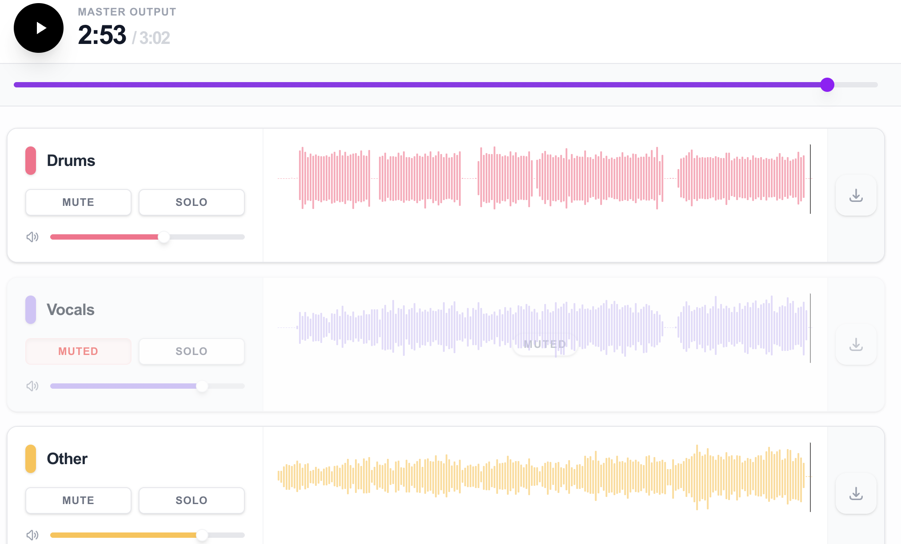

<div align="center">
  

  <br />
  <br />

  <h1>🎵 S T E M S P L I T</h1>
  <p style="font-size: 1.2rem; color: #a0a0a0;">
    The Next-Generation AI Audio Isolation Platform
  </p>

  <p>
    
    
    
    
  </p>

  <br />
</div>

---

## ✨ Features

<div align="center">
<table>
  <tr>
    <td align="center" width="33%">
      <h3>🎷 AI Stem Separation</h3>
      <p>Powered by Deezer's Spleeter engine to isolate <strong>Vocals, Drums, Bass,</strong> and <strong>Other</strong> tracks with studio-quality precision.</p>
    </td>
    <td align="center" width="33%">
      <h3>🎛️ Multi-Track Editor</h3>
      <p>Advanced <strong>DAW-like interface</strong>. Mute, Solo, and mix tracks individually. Visualize waveforms in real-time.</p>
    </td>
    <td align="center" width="33%">
      <h3>🌓 Dynamic Theme</h3>
      <p>Futuristic <strong>Glassmorphism</strong> UI with seamless Dark/Light mode switching and fluid animations.</p>
    </td>
  </tr>
</table>
</div>

## 🏗️ Architecture

A robust microservices architecture designed for scalability and performance.

| Component | Port | Tech Stack | Description |
|-----------|------|------------|-------------|
| **Frontend** | `3000` | Next.js, React, Tailwind | Futuristic Client Interface |
| **Backend** | `3001` | Node.js, Express | API Gateway & File Management |
| **Engine** | `8000` | Python, FastAPI, Spleeter | AI Processing Unit |

<br/>

## 🚀 Quick Start

### 1. Prerequisites
- **Node.js** (v18+)
- **Python** (3.8+)
- **FFmpeg** (Required for audio processing)

### 2. Installation

Clone the repository and prepare the services:

```bash
# 1. Setup AI Worker (Python)
cd worker
python3 -m venv venv
source venv/bin/activate
pip install -r requirements.txt

# 2. Setup Backend
cd ../server
npm install

# 3. Setup Frontend
cd ../client
npm install
```

### 3. Launch Sequence 🛸

Run all services simultaneously in separate terminals:

| Terminal 1 (AI Worker) | Terminal 2 (Server) | Terminal 3 (Client) |
|------------------------|---------------------|---------------------|
| `cd worker` | `cd server` | `cd client` |
| `source venv/bin/activate` | `npm start` | `npm run dev` |
| `uvicorn main:app --reload --port 8000` | _Listening on port 3001_ | _Listening on port 3000_ |

<br/>
<div align="center">
  <a href="http://localhost:3000">
    
  </a>
</div>
<br/>

## 🛠️ Usage Protocol

1.  **Initiate**: Navigate to `http://localhost:3000`.
2.  **Upload**: Drag & Drop your MP3/WAV file into the holographic upload zone.
3.  **Process**: Watch the terminal-style build log as the AI extracts stems.
4.  **Manipulate**: Use the multi-track editor to remix, solo, or download individual stems.

## 🔮 Future Roadmap

- [ ] **Cloud Integration**: AWS S3/CloudFront storage backend.
- [ ] **Async Queues**: Redis/Celery implementation for high-load processing.
- [ ] **GPU Acceleration**: NVIDIA CUDA support for 100x speedup.
- [ ] **Export Mix**: Re-combine tracks into a downloadable master mix.

---

<div align="center">
  <p>Designed for the Future of Audio Engineering</p>
  <sub>© 2024 StemSplit Project</sub>
</div>
